# Wholesome Basket

Wholesome Basket is an e-commerce site developed to provide a simple and secure way to shop for whole foods. Built using Django, the site is designed to be responsive, making it easy to use on any device. It focuses on clean, maintainable code and smooth navigation, aiming to offer a reliable shopping experience for users.

The Wholesome Basket website is targeting health-conscious consumers and individuals interested in purchasing whole, natural, and organic foods. This includes those who are looking for healthy, unprocessed food options, including people following specific dietary lifestyles like vegan, gluten-free, or other dietary restrictions. The site aims to serve a community that values nutritious, sustainable, and ethically sourced food products.


Checkout the live website [here](https://wholesome-basket-e-commerce-72c9883373ee.herokuapp.com/).

---

## [Table of Contents](#table-of-contents)

1. [User Experience](#user-experience)
2. [The Strategy Plane](#the-strategy-plane)
    - [Project Goals](#project-goals)
    - [Target Audience](#target-audience)
    - [First Time User Benefits](#first-time-user-benefits)
    - [Registered User Benefits](#registered-user-benefits)
    - [Admin User Benefits](#admin-user-benefits)
3. [Agile Methodology](#agile-methodology)
    - [User Stories](#user-stories)
4. [Fundamental Structure](#fundamental-structure)
    - [Wireframes](#wireframes)
    - [Entity Relationship Diagram](#entity-relationship-diagram-erd)
5. [Main Plan](#main-plan)
6. [Structure Plane](#structure-plane)
	- [Features](#features)
		- [Home Page](#home-page)
		- [Footer](#footer)
			- [About Us Page](#about-us-page)
			- [Get in Touch Page](#get-in-touch-page)
			- [Privacy Policy Page](#privacy-policy-page)
			- [Returns Policy Page](#returns-policy-page)
		- [Main Navigation Menu](#main-nav-menu)
			- [Search Bar](#search-bar)
			- [Main Nav Bar](#main-nav-bar)
			- [Basket Page](#basket-page)
			- [Wishlist Page](#wishlist-page)
			- [Product Management Tab](#product-management-tab)
			- [Account Info Page](#account-info-page)
			- [Authentication Features](#authentication-features)
		- [All Products Page](#all-products-page)
		- [Product Detail Page](#product-detail-page)
		- [Checkout Page](#checkout-page)
		- [Checkout Success Page](#checkout-success-page)
		- [Error Pages](#error-pages)
	- [Future Features](#future-features)
7. [Design](#design)
	- [Colour Scheme](#colour-scheme)
	- [Typography](#typography)
	- [Images](#images)
8. [Business Model](#business-model)
	- [SEO and Marketing Strategy](#seo-and-marketing-strategy)
9. [Technologies](#technologies)
	- [Languages Used](#languages-used)
	- [Frameworks](#frameworks-used)
	- [Libraries and Installed Packages](#ibraries-and-installed-packages)
	- [Tools and Resources](#tools-and-resources)
10. [Testing](#testing)
11. [Bugs](#fixed-bugs)
12. [Credits](#credits)
13. [Deployment](#deployment)
	- [PostgreSQL Database](#postgresql-database)
	- [Amazon web Services](#amazon-web-services-aws)
	- [Stripe API](#stripe-api)
	- [Gmail API](#gmail-api)
	- [Heroku Deployment](#heroku-deployment)
	- [Local Deployment](#local-deployment)
	- [Cloning](#cloning)
14. [Acknowledgements](#acknowledgements)


## User Experience (UX)

The user experience of Wholesome Basket is designed to be **intuitive** and **user-friendly**.
Users can easily navigate through **well-organized** categories and a **responsive search function**.
The site offers **detailed product information**, ensuring informed decisions, and a **smooth, secure checkout process**.
It's **mobile-friendly**, with features like **wishlists** and **personalized profiles** enhancing the shopping experience.
The **clean design** and **quick access to support** make the site pleasant and reliable to use across all devices.

<br>

[Back to Top](#table-of-contents)

<br>

## The Strategy Plane

### Project Goals

The goal of the Wholesome Basket website is to provide a user-friendly platform where customers can easily browse, select, and purchase a variety of whole, natural, and organic food products. The project aims to promote healthier eating habits by offering high-quality, unprocessed foods that cater to various dietary needs and preferences. Additionally, the website seeks to create a seamless online shopping experience that emphasizes accessibility, convenience, and customer satisfaction.

<br>

[Back to Top](#table-of-contents)

<br>

### Target Audience

 - **Health-Conscious Individuals**: People who are focused on maintaining a balanced diet and overall well-being, often seeking out products that support a healthy lifestyle.

- **Organic Food Enthusiasts**: Consumers who prefer organic products, free from synthetic pesticides and fertilizers, and are committed to sustainable and environmentally friendly farming practices.

- **Individuals with Dietary Restrictions**: Those who have specific dietary needs, such as gluten-free, dairy-free, or vegan diets, and seek out products that cater to these requirements.

- **People Looking to Reduce Sugar Intake**: Individuals who are conscious about reducing their sugar consumption and are in search of natural alternatives or low-sugar products.

- **Home Cooks and Food Enthusiasts**: Those who enjoy cooking from scratch and are looking for high-quality, whole ingredients to prepare their meals.

- **Families Focused on Nutrition**: Parents and caregivers who prioritize nutritious meals for their families and are interested in wholesome products that support healthy eating habits.

- **Environmentally Conscious Consumers**: People who are concerned about the environmental impact of their food choices and prefer to purchase products that are sustainably sourced and packaged.

- **Individuals Interested in Specialty Foods**: Consumers looking for specialty or hard-to-find whole food products that may not be available in regular grocery stores.

This diverse audience is united by a common goal of making informed, health-oriented decisions about the food they consume, and they seek a shopping experience that aligns with their values and dietary preferences.

<br>

[Back to Top](#table-of-contents)

<br>

### First Time User Benefits

- **Effortless Navigation**: The website is designed with user-friendly navigation, making it easy for first-time visitors to explore the product catalog. Users can seamlessly browse through categories, access the product list, and quickly find what they’re looking for.
- **Efficient Search Functionality**: A prominent search bar is available, allowing users to swiftly locate specific products they have in mind. This feature enhances the shopping experience by reducing the time spent searching for items.
- **Informative Product Details**: Each product page is rich with essential information. Users can easily access detailed descriptions, including ingredients, nutrition facts, and additional insights that help them make informed purchasing decisions.
- **Simple Registration Process**: New users can quickly create an account with minimal steps, enabling them to start shopping without delays. The registration process is straightforward and designed to encourage engagement.
- **Smooth Payment Experience**: The checkout process is intuitive and efficient, ensuring that users can complete their purchases without any hassle. The payment system is secure and easy to navigate, contributing to a positive overall experience.

<br>

[Back to Top](#table-of-contents)

<br>

### Registered User Benefits

- **Secure and Personalized Login**: Registered users can log in easily to their secure, personalized account, providing a tailored shopping experience.

- **Saved Account Details**: Users can save their personal and payment details to their account, making future shopping sessions more convenient and streamlined.

- **Wishlist and Basket Management**: Registered users can effortlessly add items to their wishlist or directly to their basket, allowing them to save favorite products for later or proceed to purchase.

- **Product Ratings**: Users have the ability to rate products, helping to share their experiences with others and contribute to the community.

- **Persistent Shopping Cart**: Products added to the basket are saved, so users can continue shopping at their own pace without losing their selections.

- **Faster Checkout Process**: With saved details and a personalized account, registered users can enjoy a quicker, more efficient checkout process.

<br>

[Back to Top](#table-of-contents)

<br>

### Admin User Benefits

- **Full Product Management**: Admin users can easily add, edit, and delete products through a user-friendly interface, ensuring the store's inventory is always up-to-date.

- **Category Management**: Admins can efficiently add or remove product categories directly from the admin panel, allowing for flexible organization of products.

- **User Management**: Admin users have the authority to manage the user base, including the ability to remove users when necessary, maintaining the integrity of the community.

<br>

[Back to Top](#table-of-contents)

<br>


## Agile Methodology

This project follows an Agile methodology to ensure flexibility, collaboration, and continuous delivery of features. Here's how the process is managed:
- **User story creation**: User stories are created to define the project goals and user requirements. Each story is a concise description of a feature from the user's perspective, helping to clarify what needs to be built and why.
- **Iterations**: The work is organized into iterations (sprints), with each iteration focusing on completing specific user stories. This approach helps to keep tasks organized and planned, ensuring that progress is made steadily.
- **Progress tracking**: Progress is tracked using GitHub project boards. User stories move from To Do to In Progress, and finally to Done when completed. This helps in keeping track of what's being worked on and what's already completed.
- **Priority labelling**:
    User stories are labeled to manage their priority effectively:
    - **Must Have**: Essential features that will be delivered.
    - **Should Have**: Important features that should be delivered but are not critical.
    - **Could Have**: Nice-to-have features that add value but are not essential.
    - **Won't Have**: Features that will not be included in this project cycle.

This approach helps to maintain focus on delivering the most important features while allowing flexibility for adjustments as the project progresses.

<br>

[Back to Top](#table-of-contents)

<br>

<details>
<summary> User Stories Template
</summary>


</details>

<details>
<summary> User Stories, Issues
</summary>


</details>

<details>
<summary> Project Milestones
</summary>


</details>

<details>
<summary> Project Board
</summary>


- <a href="https://github.com/Monicaular/wholesomebasket" target="_blank">Visit GitHub repository here.</a>

- <a href="https://github.com/users/Monicaular/projects/6" target="_blank">Visit GitHub Project roadmap here.</a>

</details>

<br>

[Back to Top](#table-of-contents)

<br>

### User Stories

Iterations

- Iteration 1: Project Setup and Core Foundation
    - Install Django and supporting libraries.
    - Create a new Django project and app.
    - Set up the project to use PostgreSQL.
    - Deploy to Heroku.
    - Viewing products list to choose items/pagination.
    - Identifying website products.

- Iteration 2: User Authentication and Basic E-commerce Features
    - Easy account registration.
    - Easy login and logout.
    - Easy password recovery.
    - Receiving an email confirmation after registering.
    - Selecting quantity for a product.
    - Viewing total purchase amount.
    - Searching products by name or description.
    - Wishlist feature.

- Iteration 3: Product Management and Display
    - Displaying ingredients and allergens for products.
    - Displaying nutrition facts for products.
    - Sorting products by name, price, rating, categories.
    - Sorting products with a specific category.
    - Sorting multiple categories simultaneously.
    - Rating feature.

- Iteration 4: Admin Features and User Experience
    - Adding products for site admin.
    - Editing products for site admin.
    - Deleting products for site admin.
    - Viewing total purchase amount.
    - Receiving an email with order summary.

- Iteration 5: Final Touches and Testing
    - Search and filter functionality refinement.
    - Final testing and bug fixing.
    - Code refactoring and optimization.
    - Comprehensive documentation creation.
    - Final deployment and stress testing.

For detailed look of the project board, check this [link](https://github.com/users/Monicaular/projects/6).

<br>

[Back to Top](#table-of-contents)

<br>

## Fundamental Structure

I designed detailed wireframes for both mobile and desktop versions of the project using Lucidchart to ensure a seamless and responsive user experience across all devices.

### Wireframes

### Home Page

<details>
<summary>Home Page Wireframe</summary>

#### Mobile
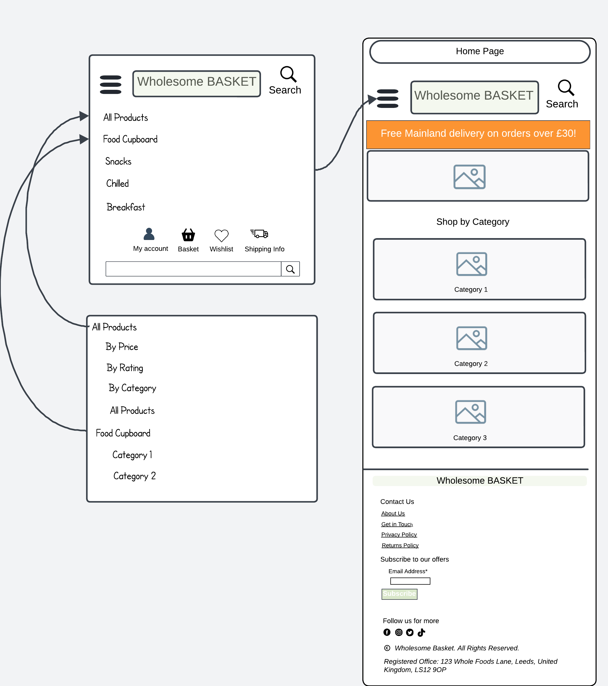


#### Desktop


</details>

### Products List Page

<details>
<summary>Products List Wireframe</summary>

#### Mobile
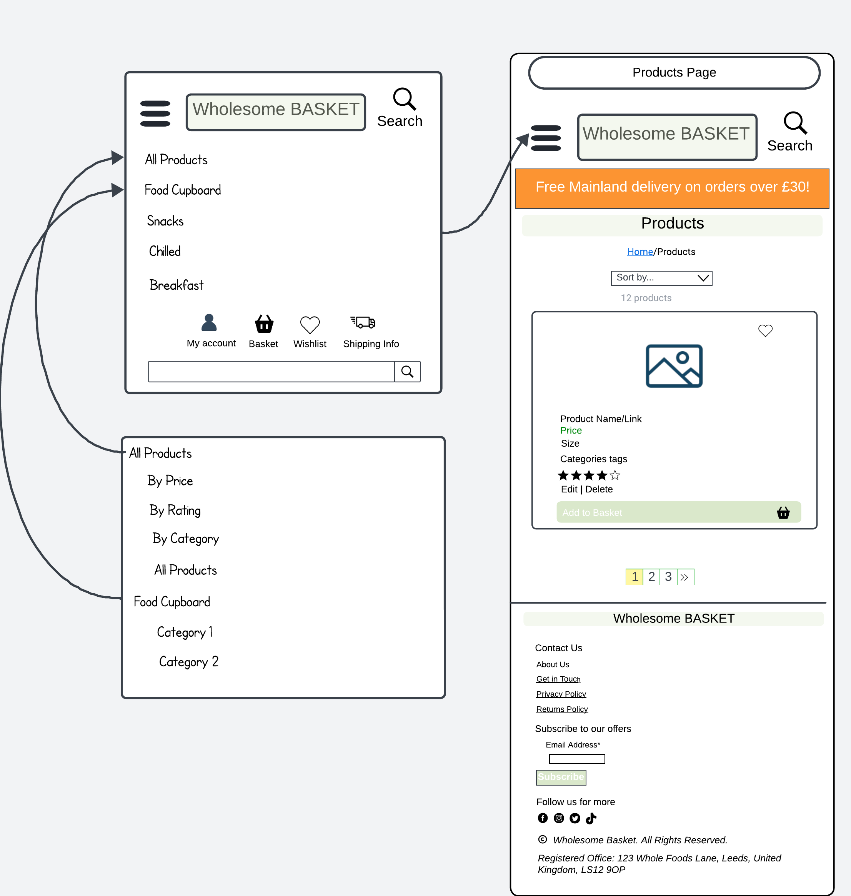


#### Desktop


</details>

### Product Details Page

<details>
<summary>Products Detail Wireframe</summary>

#### Mobile
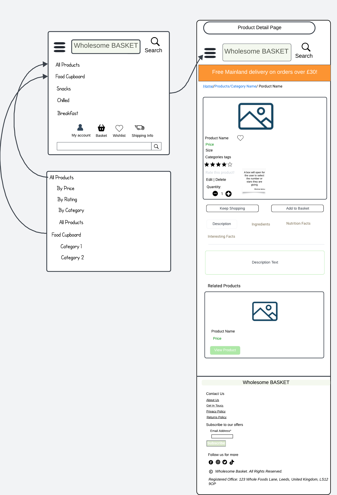


#### Desktop


</details>

### Basket Page

<details>
<summary>Basket Page Wireframe</summary>

#### Mobile
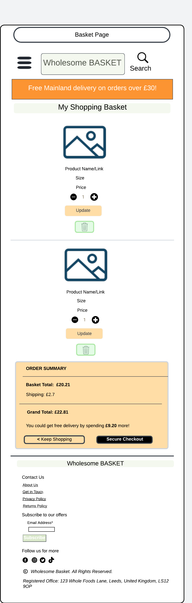


#### Desktop


</details>

### Checkout Page

<details>
<summary>Checkout Page Wireframe</summary>

#### Mobile
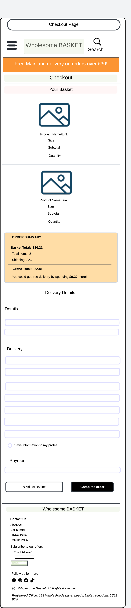


#### Desktop


</details>

### Checkout Success Page

<details>
<summary>Checkout Success Page Wireframe</summary>

#### Mobile
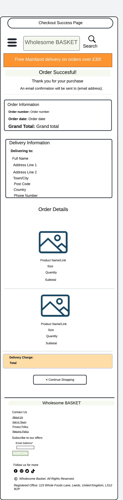


#### Desktop


</details>

### Add a Product

<details>
<summary>Add a Product Page Wireframe</summary>

#### Mobile
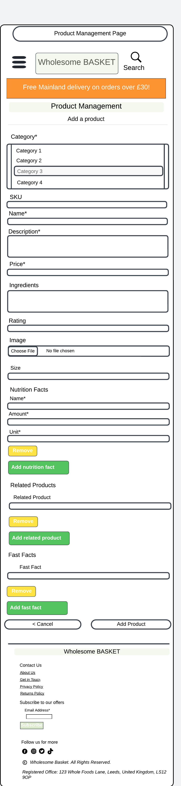


#### Desktop


</details>

### Edit a Product Page

<details>
<summary>Edit a Product Page Wireframe</summary>

#### Mobile
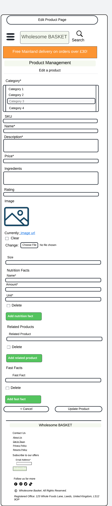


#### Desktop


</details>

### My Account Page

<details>
<summary>Account Dashboard Page Wireframe</summary>

#### Mobile


#### Desktop


</details>

<details>
<summary>Order History Page Wireframe</summary>

#### Mobile
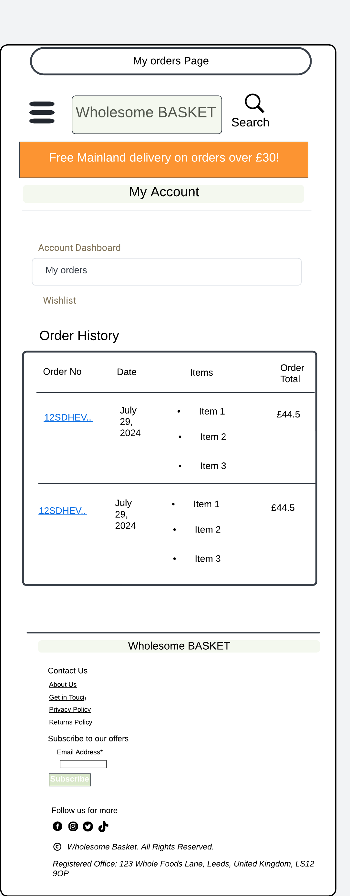


#### Desktop


</details>

<details>
<summary>Wishlist Page Wireframe</summary>

#### Mobile
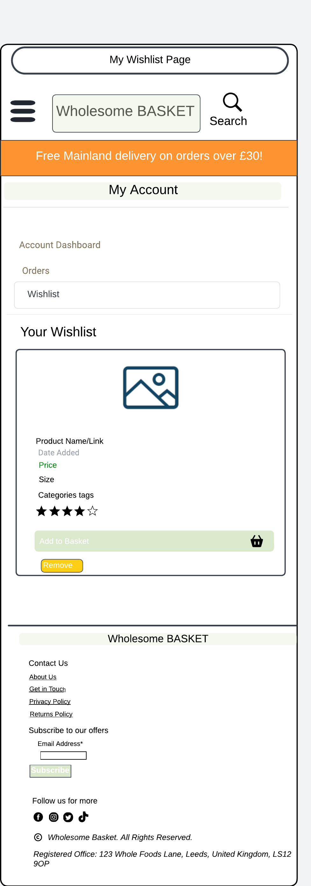


#### Desktop


</details>

### Wishlist Page

<details>
<summary>Wishlist Page Wireframe</summary>

#### Mobile
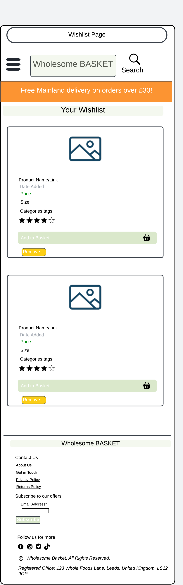


#### Desktop


</details>

### Authentication Pages

<details>
<summary>Sign Out Wireframe</summary>

#### Mobile
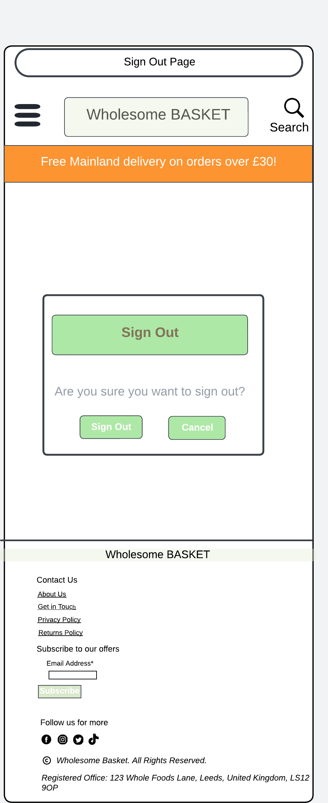


#### Desktop


</details>

<details>
<summary>Sign In Wireframe</summary>

#### Mobile
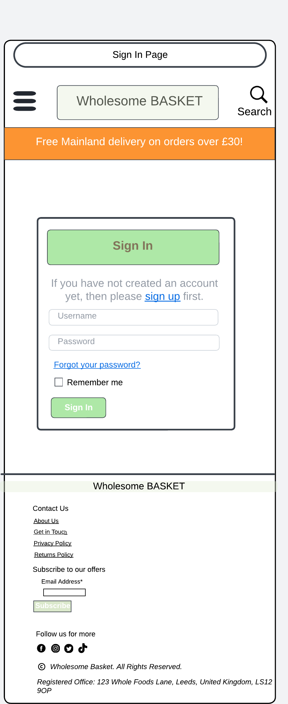


#### Desktop


</details>

<details>
<summary>Sign Up Wireframe</summary>

#### Mobile
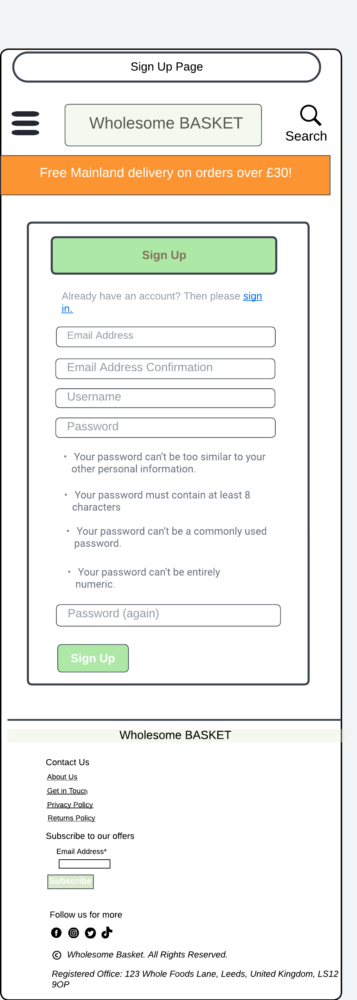


#### Desktop


</details>

<br>

[Back to Top](#table-of-contents)

<br>

### Entity Relationship Diagram (ERD)

I created an Entity-Relationship Diagram (ERD) to visually represent the database structure and relationships within the project. This ERD was carefully crafted to ensure efficient data management and clear associations between various entities, such as products, users, orders, and ratings. By mapping out the database design in advance, I was able to identify and implement the necessary tables and relationships, ensuring that the application's data flow is both logical and scalable.

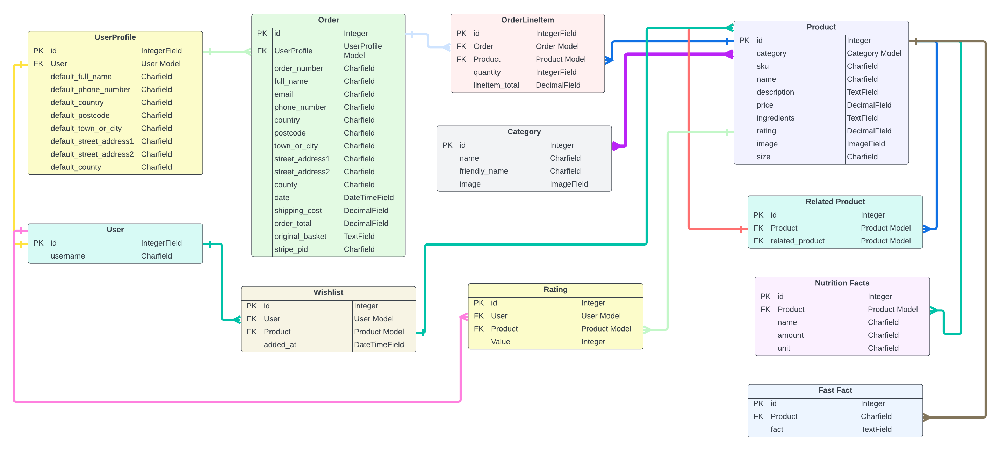

<br>

[Back to Top](#table-of-contents)

<br>

## Main Plan

- **Designing a visually appealing homepage** that highlights the website's focus on whole foods, making it clear to users what the site offers right from the start.
- **Implementing a product catalog** that allows users to browse, search, and filter products based on various criteria such as categories, price, and ratings.
- **Setting up secure user accounts** to enable features like adding items to wishlists, saving basket contents, and providing a personalized shopping experience with faster checkouts.
- **Developing a fully responsive website** that delivers a seamless user experience across all devices, with special attention to mobile-friendly navigation and optimized page load speeds.
- **Empowering superusers with the ability** to manage the product catalog, including adding, editing, and deleting products, as well as managing categories and user accounts directly from the admin panel.

<br>

[Back to Top](#table-of-contents)

<br>

## Structure Plane

### Features

#### Home Page

- **Hero Image with Welcome Text:** The homepage features a striking hero image that immediately captures the user's attention. Overlaid on the image is a warm welcome message that reads, "Welcome to Wholesome Basket. Start your health journey here." This introduction sets the tone for the site, inviting users to explore further. Below the text, a prominent "Shop Now" button is placed, encouraging users to begin shopping with just one click.


- **Shop by Category Section:** Directly below the hero image, the homepage showcases a "Shop by Category" section. This section features key product categories, each represented with visually appealing images. Users can easily click on these images to navigate directly to their desired category, streamlining the shopping experience and helping them find what they need quickly.


<br>

[Back to Top](#table-of-contents)

<br>

#### Footer
The footer maintains a consistent presence across all pages, providing easy access to essential links and features no matter where users navigate on the site. This uniformity ensures that users always have a convenient way to reach contact information, policy details, and social media channels, enhancing overall site usability and cohesion.

- **Contact Us Section**: This section provides essential links and options for user support and information. It includes an "About Us" link that gives users insight into the website's mission, a "Get in Touch" contact form for direct inquiries, a "Privacy Policy" link outlining how user data is handled, and a "Returns Policy" link detailing the process for returns.
- **Subscribe to Our Offers**: Adjacent to the contact section is a subscription area where users can enter their email address to join the mailing list and receive updates on offers and promotions.

- **Social Media Links**: To foster community engagement and provide more ways to stay connected, the footer includes links to the website's social media profiles on Facebook, X (formerly Twitter), Instagram, and TikTok.

<br>

[Back to Top](#table-of-contents)

<br>

##### About Us Page

The "About Us" page at Wholesome Basket outlines the brand's commitment to natural, sustainable foods and making healthy eating accessible. It emphasizes quality products, customer care, and eco-friendly practices, inviting users to connect with the team for support and feedback.


##### Get in Touch Page

The "Contact Us" page features a simple form where users can provide their email, subject, and message to get in touch with the team. Additionally, there's an option to subscribe to the newsletter by ticking a box.


<br>

[Back to Top](#table-of-contents)

<br>

##### Privacy Policy Page

The Privacy Policy page outlines how Wholesome Basket collects, uses, and protects user information. It provides details on data privacy, user rights, and the measures in place to ensure the security of personal data.


<br>

[Back to Top](#table-of-contents)

<br>

##### Returns Policy Page

The Returns Policy page details Wholesome Basket's commitment to customer satisfaction with a "No Quibbles 30 Day Quality Guarantee" for UK customers. It explains the process for returning products within 30 days for a full refund, including instructions on how to return items, conditions for returns, and procedures for handling damaged orders.


<br>

[Back to Top](#table-of-contents)

<br>

#### Main Nav Menu

##### Search Bar

In the top-middle section of the main navigation bar, there is a search bar where users can search for products by entering a word or a fragment of a word found either in the product name or description. If no products match the search term, the results will display `'0 products found.'` Otherwise, the search results will list the matching products and indicate the total number of products containing the entered word. If the search bar is submitted without any input, an error message will appear stating, `'You need to enter a search criteria.'`


<br>

[Back to Top](#table-of-contents)

<br>


##### Main Nav Bar

- In the next line of the main navigation, there are 5 main categories, one of which is the "All Products" tab where users can sort products by price, rating, and category, as well as display all products on the page.


- The other 4 tabs break down the main categories into subcategories, allowing users to more easily select the products they are looking for.

    

- At the right end of this navigation line, there are tabs for Account, Shopping Basket, Wishlist, and Delivery Information.


- The Account tab displays a register/login dropdown for users who are logged out or do not have an account. For users who are logged in, the tab shows their account details and a log out button. If they are the admin of the site, the product management feature is also available here.


<br>

[Back to Top](#table-of-contents)

<br>

##### Basket Page

- In the basket tab, users can view the products in their basket if any are present; otherwise, it will indicate that the basket is empty.

 

- A scrollable summary of the basket is displayed each time the user adds an item to the basket. This message box also informs them of the amount they still need to spend to qualify for free delivery.

 

- On the basket page, users can adjust the quantity of products by using the quantity button and then pressing "Update." A message will appear confirming that the quantity has been updated to the specified number.


- When updating the quantity of the products, the order summary details are automatically updated as well.


<br>

[Back to Top](#table-of-contents)

<br>

##### Wishlist Page

- In the Wishlist tab, logged-in users can view products they have saved. If the wishlist is empty, the page will indicate this. Users who are not logged in are redirected to the login page when they attempt to access this feature.

 


- The last tab in the main navigation bar is the Delivery Info tab, which is available to all users and contains the delivery terms and conditions.


<br>

[Back to Top](#table-of-contents)

<br>

### My Account Tab

##### Product Management

###### Add a Product Form

- As previously mentioned, the product management tab provides admin users with access to an "Add a Product" page, where they can add new products to the catalog. This page also includes a feature that allows them to preview any uploaded images.


- When admin users add a new product, they receive a message confirming that the product has been successfully added and are then redirected to the product's page.


<br>

[Back to Top](#table-of-contents)

<br>

###### Edit Product Form

- The edit product form appears for admin users when they click on "Edit" either from the products list page or the product detail page. This form is pre-filled with the existing product information, allowing them to add, remove, or modify any fields as needed.


- While on the editing form, users receive a notification indicating which product they are currently editing.


- After updating the product, the user receives a notification confirming that the product has been successfully updated and is then redirected to the product's page.


<br>

[Back to Top](#table-of-contents)

<br>

###### Delete Product Section

- The admin user has the option to delete a product by clicking on the delete button, which is displayed next to the product photo while they are logged in.


- When they click the delete button, a modal appears asking for confirmation, giving them the option to cancel if they change their mind.


- If they proceed with deleting the product, they are redirected to the products list page and receive a success message confirming the deletion.


<br>

[Back to Top](#table-of-contents)

<br>


##### Account Info

- In the "My Account" tab, users can view their account information, including their username, email, and address. A button is available to update this information, which will bring up a form for making any necessary corrections.

 

- Additionally, there is a "My Orders" tab where users can view a list of their past orders along with the order details.


- The final section within the "My Account" tab is the Wishlist, where users can see the products they've added. Here, they have the option to either remove items or add them to their basket.


<br>

[Back to Top](#table-of-contents)

<br>

##### Authentication Features

The buttons for the authentication pages are located in the "My Account" tab. If the user is logged in, they have the option to log out. If they are not logged in, they can choose to register or sign in. Additionally, the sign-in page is automatically prompted when users attempt to access the Wishlist page.

###### Sign In


- When a user signs in, they receive a message confirming that they are logged in as their username.


<br>

[Back to Top](#table-of-contents)

<br>

###### Sign Out


- When a user signs out, they receive a notification confirming that they have successfully signed out.


<br>

[Back to Top](#table-of-contents)

<br>

###### Register


- When a user signs up, they receive a message indicating that a confirmation email has been sent to their email address.


- The user receives an email containing a link that they can click to confirm their email address.


- After the user clicks the link in the email, they are directed to a page where they receive a notification with a button labeled "Confirm."


- When they press the "Confirm" button, they receive a success message indicating that their email has been confirmed and are then redirected to the sign-in page.


<br>

[Back to Top](#table-of-contents)

<br>

#### All Products Page

- This page includes several features for an improved user experience. Users are shown 12 products per page, with pagination provided to prevent endless scrolling and to ensure faster page loading.


- Users can sort all products by price, rating, name, or category, in either ascending or descending order. Additionally, they can filter and display a specific category in real-time from the left-hand side of the page.


- The sorting options—by price, rating, name, or category—remain consistent even when users navigate to the next page, ensuring the sorting preferences do not reset. 

    


- Users can also easily skip to the first or last page using the pagination feature.


- Users can add products to their wishlist by clicking on the heart icon located in the top-right corner of the product image.


- If users already have a certain product in their wishlist, they will receive a message indicating that the product is already there.


- To add a product to the basket, users can click on the "Add to Basket" button at the bottom of the product card.

    

<br>

[Back to Top](#table-of-contents)

<br>

#### Product Detail Page

- On this page, users can view all the details of the product, including the name, price, size, rating, description, ingredients, nutrition facts, interesting facts, and some related products. 


- Users have the option to add the product to their wishlist, rate the product, select a quantity, add it to the basket, or simply return to the products page. Logged-in users can perform all these actions, while other users can only select the quantity and add the product to the basket.


- Admin users have the ability to edit or delete this product, but these buttons are hidden from other users.

- For easy navigation, the user also has access to a breadcrumb navigation bar on the product detail page.


<br>

[Back to Top](#table-of-contents)

<br>


#### Checkout Page

- Guest users also have the option to proceed with checkout. On the checkout page, users are presented with a basket summary and a form that they need to fill out with their delivery details and card information.


- On the checkout page, users can view the products in their basket, along with an order summary that includes the total costs and the number of items they have.


- On the checkout page, users are shown their order summary again, including all the associated costs.


- Also on the checkout page, users are presented with a form to fill in their delivery and card details. If the user has previously saved their information in the account info section, the delivery details will be prefilled.


- Lastly, on the checkout page, users are presented with two buttons. One button allows them to modify their basket and redirects them to the basket page if clicked. The other button takes them to the successful checkout page, displaying a loading screen while the payment is being processed. Below these buttons, the amount that will be charged to their card is clearly displayed.


<br>

[Back to Top](#table-of-contents)

<br>

#### Checkout Success Page

- On the checkout success page, users are presented with a thank you message, along with their order information, delivery details, and a summary of their order. Additionally, they are informed that a confirmation has been sent to their email address.


- The email confirmation is sent to the email address they signed up with and includes a summary of the order and delivery details.


<br>

[Back to Top](#table-of-contents)

<br>


#### Error Pages

##### Error 404


##### Error 500


<br>

[Back to Top](#table-of-contents)

<br>

### Future Features

- Allow users to select the quantity of products they wish to purchase, initially designed for bulk buying.
- Enable customers to leave detailed reviews that include text and photos.
- Offer discounts and special promotions to incentivize purchases.
- Provide multiple images for each product to give a better visual representation.
- Display real-time stock levels to inform customers of product availability.
- Implement a recommendation system that suggests products based on users' previous purchases.

<br>

[Back to Top](#table-of-contents)

<br>

## Design

### Colour Scheme


These colors have been chosen for the Wholesoem Basket's website because they align with the brand's identity and values, creating a visual experience that resonates with the natural, organic, and sustainable focus of the brand.

- The chosen colors create a balance between vibrancy and earthiness, reflecting Whole Foods' brand values of health, sustainability, and natural living.
- The greens and yellows evoke freshness and vitality, key qualities associated with organic foods.
- The neutral tones like cinereous, timberwolf, and beige provide a calming backdrop that enhances readability and focuses attention on the content.

Together, these colors create a cohesive, inviting, and trustworthy aesthetic that aligns with the Whole Foods brand and appeals to its target audience.

<br>

[Back to Top](#table-of-contents)

<br>


### Typography

**Playwrite IT Moderna** and **Playwrite NG Modern** are sleek, contemporary typefaces that bring a touch of sophistication and modernity to your site. These fonts are used for headings, logos, and key elements where a strong, stylish impact is needed. Their clean lines and refined appearance help convey professionalism and innovation, reflecting the brand's commitment to offering high-quality, modern products.

**Raleway** is a highly versatile and elegant font that complements the Playwrite fonts with its range of weights from light to bold. Raleway is used for body text and other content where readability is crucial, offering a smooth and pleasant reading experience. Its modern yet approachable style ensures that the text remains clear and engaging, supporting the site's clean and user-friendly design.

<br>

[Back to Top](#table-of-contents)

<br>

### Images

Most of the images used on the site are sourced from another website, with their permission. Additionally, some images are from free stock photo websites like [Pexels](https://www.pexels.com/) and [Vecteezy](https://www.pexels.com/).

<br>

[Back to Top](#table-of-contents)

<br>

## Business Model

This online platform operates on a Business to Consumer (B2C) model, offering customers the ability to purchase organic and wholesome products directly. It is designed to facilitate seamless transactions for both registered and unregistered users, with enhanced features and benefits available to registered members and newsletter subscribers.

### SEO and Marketing Strategy

- **Meta Data**: Implemented meta tags in the HTML, including both short-tail and long-tail keywords to improve search engine ranking.
- **Image Optimization**: Named all images specifically according to the products they represent to enhance search relevance.
- **Sitemap Generation**: Created a sitemap to ensure thorough indexing by search engines.
- **Robots.txt File**: Added a robots.txt file to guide search engine crawlers effectively.
- **Security Enhancement**: 
    - Applied the rel="noopener" attribute to external links for improved security.
- **Page Load Optimization**: 
    - Enhanced page load speed through the use of pagination and by compressing images.
- **Social Media Marketing**:
   -  The Facebook business page serves as a hub for connecting with the community, sharing updates on the latest organic and wholesome products, promoting special offers, and providing valuable content related to health and wellness. It's a space where customers can engage with the store, stay informed about new arrivals, and join in discussions around living a healthier lifestyle.

   [Link to the Facebook Business Page](https://www.facebook.com/profile.php?id=61563483779485)


   

- **Newsletter Marketing**: 
    - I’ve integrated a Mailchimp sign-up form in the footer, which serves as a convenient way for users to subscribe to the newsletter, keeping them informed about the latest products, special offers, and updates.

        

<br>

[Back to Top](#table-of-contents)

<br>

## Technologies

### Languages used

* [HTML5](https://en.wikipedia.org/wiki/HTML5)
* [CSS3](https://en.wikipedia.org/wiki/Cascading_Style_Sheets)
* [Javascript](https://en.wikipedia.org/wiki/JavaScript)
* [Python](https://en.wikipedia.org/wiki/Python_(programming_language))

<br>

[Back to Top](#table-of-contents)

<br>

### Frameworks Used

* [Django](https://www.djangoproject.com/)
* [Bootstrap](https://blog.getbootstrap.com/)


<br>

[Back to Top](#table-of-contents)

<br>


### Libraries and Installed Packages

- [**asgiref==3.8.1**](https://asgi.readthedocs.io/en/latest/): provides a reference implementation of the ASGI standard, which is used for handling asynchronous requests in Django and other Python web frameworks.
- [**boto3==1.34.136**](https://boto3.amazonaws.com/v1/documentation/api/latest/index.html): The Amazon Web Services (AWS) SDK for Python, which allows developers to interact with AWS services like S3, EC2, and others.
- [**botocore==1.34.136**](https://botocore.amazonaws.com/v1/documentation/api/latest/index.html): A low-level core package used by `boto3` to interact with AWS services, handling the underlying API requests.
- [**countries==0.2.0**](https://pypi.org/project/pycountry/): A package that provides an easy-to-use list of country names and codes, useful for forms and databases.
- [**crispy-bootstrap5==2024.2**](https://django-crispy-forms.readthedocs.io/en/latest/crispy_tag_forms.html#bootstrap5): A Django package that integrates Bootstrap 5 with `django-crispy-forms`, enabling easy and customizable form styling.
- [**dj-database-url==2.2.0**](https://pypi.org/project/dj-database-url/): A utility that allows easy configuration of Django databases using a single URL, simplifying database setup, especially in deployment.
- [**Django==4.2.13**](https://docs.djangoproject.com/en/stable/): A high-level Python web framework that promotes rapid development and clean, pragmatic design.
- [**django-allauth==0.63.3**](https://django-allauth.readthedocs.io/en/latest/): A Django package that provides a comprehensive solution for handling user authentication, including social logins and account management.
- [**django-countries==7.6.1**](https://pypi.org/project/django-countries/): A Django package that provides country choices for use in Django models, forms, and views.
- [**django-crispy-forms==2.2**](https://django-crispy-forms.readthedocs.io/en/latest/): A Django application that allows for DRY (Don't Repeat Yourself) forms by helping to control the rendering behavior of Django forms.
- [**django-storages==1.14.3**](https://django-storages.readthedocs.io/en/latest/): A Django package that provides a variety of storage backends, including support for storing files on AWS S3 and other cloud services.
- [**gunicorn==22.0.0**](https://docs.gunicorn.org/en/stable/): A Python WSGI HTTP Server for UNIX, often used to deploy Django applications in production environments.
- [**jmespath==1.0.1**](https://jmespath.org/): A package that provides a query language for searching and manipulating JSON data, used primarily with AWS services.
- [**pillow==10.3.0**](https://pillow.readthedocs.io/en/stable/): A powerful image processing library in Python, used for opening, manipulating, and saving many different image file formats.
- [**psycopg2==2.9.9**](https://www.psycopg.org/docs/): A popular PostgreSQL database adapter for Python, commonly used with Django to interact with PostgreSQL databases.
- [**s3transfer==0.10.2**](https://boto3.amazonaws.com/v1/documentation/api/latest/guide/s3-example-download-file.html#download-a-file-from-s3): A utility package used by `boto3` to efficiently manage file uploads and downloads to and from AWS S3.
- [**sqlparse==0.5.0**](https://sqlparse.readthedocs.io/en/latest/): A non-validating SQL parser for Python, used for splitting, formatting, and parsing SQL statements.
- [**stripe==10.3.0**](https://stripe.com/docs/api): The official Python library for Stripe, a service that allows developers to handle online payments and transactions easily.

<br>

[Back to Top](#table-of-contents)

<br>

### Tools and Resources

- [**GitHub**](https://github.com/): Version control and collaboration platform.
- [**Gitpod**](https://www.gitpod.io/): Cloud-based IDE for coding.
- [**Heroku**](https://www.heroku.com/): Cloud platform for deploying and managing apps.
- [**PostgreSQL**](https://www.postgresql.org/): Open-source relational database system.
- [**Am I Responsive**](http://ami.responsivedesign.is/): Tool to view website responsiveness across devices.
- [**Temp Mail**](https://temp-mail.org/en/): Service for temporary, disposable email addresses.
- [**FreeConvert - JPG to WebP**](https://www.freeconvert.com/jpg-to-webp): Online tool for converting JPG to WebP format.
- [**Mailchimp**](https://mailchimp.com/): Email marketing and automation platform.
- [**AWS (Amazon Web Services)**](https://aws.amazon.com/): Comprehensive cloud services platform.

<br>

[Back to Top](#table-of-contents)

<br>

## Testing

For any testing procedures, please consult the [TESTING.md](TESTING.md) file.

<br>

[Back to Top](#table-of-contents)

<br>

## Fixed Bugs

Here are some of the bugs I encountered along with the solutions I implemented.

- After checkout, the user was receiving three email confirmations, with one of them not displaying the total costs. The first issue was in the webhook handler related to processing the payment intent. The payment was not succeeding because one of the order objects wasn’t recognized during the initial payment intent. I identified the problematic object by process of elimination and removed it, as it wasn’t necessary given that the Stripe payment ID (pid) is unique for each transaction. The second issue was on the Stripe account, where two webhooks were enabled, causing the confirmation to be sent twice. I resolved this by disabling one of the webhooks.

- Another frustrating bug was caused by an unclosed div tag that was obscuring my Django messages. After spending hours debugging without success, I reached out to tutor support, and they helped me identify the issue.

- When adding a new product on the product management page, the form wouldn’t allow me to save more than one nutrition fact, related product, or fast fact. I resolved this issue by modifying the view.


- A particularly significant bug I encountered occurred when I forgot to add my `env` file to the `.gitignore` file, resulting in all my secret keys being exposed in the repository. With the assistance of the tutors, I was able to resolve this issue using a tool called `git filter-repo`, which successfully removed the sensitive data from my commit history.

<br>

[Back to Top](#table-of-contents)

<br>

## Credits

This project was inspired and shaped by several valuable resources and individuals:

- **Boutique Ado Walkthrough Project from Code Institute:** Provided foundational guidance and inspiration, particularly in the structure and functionality of e-commerce features.
- **The Whiskey Drop Project:** Served as a reference for SEO and marketing strategies, contributing to the overall optimization of the project.
- **Stack Overflow:** Assisted in troubleshooting and resolving various bugs encountered during development.
- **Amazon Web Services (AWS) - Zero to Hero on Udemy by Backspace Academy**: Provided essential knowledge for working with AWS services used in this project.
- **Django Masterclass: Build 9 Real World Django Projects on Udemy by Ashutosh Pawar**: Offered practical insights and skills for developing robust Django applications.
- **The Buy Whole Foods Online Team:** Thank you for granting permission to use your photos in this project.

These resources and individuals were instrumental in the successful completion of the project.

<br>

[Back to Top](#table-of-contents)

<br>

## Deployment

The live version of the application is available on [Heroku](https://wholesome-basket-e-commerce-72c9883373ee.herokuapp.com/).

<br>

[Back to Top](#table-of-contents)

<br>

### PostgreSQL Database

The database link was provided by Code Institute, and no additional configuration was required to obtain it.

<br>

[Back to Top](#table-of-contents)

<br>

### Amazon Web Services (AWS)

This project utilizes [AWS](https://aws.amazon.com) to store media and static files online, as Heroku does not persist this type of data.

To connect your project to AWS, follow these steps after creating and logging into your AWS account. Ensure you’re on the **AWS Management Console** page.

#### S3 Bucket Setup

- Search for **S3** in the console.
- Create a new bucket, name it (preferably matching your Heroku app name), and choose the region closest to you.
- Uncheck **Block all public access** and acknowledge that the bucket will be public (necessary for it to function with Heroku).
- Under **Object Ownership**, ensure **ACLs enabled** and **Bucket owner preferred** are selected.
- In the **Properties** tab, enable static website hosting and enter `index.html` and `error.html` in their respective fields, then click **Save**.
- In the **Permissions** tab, enter the following CORS configuration:

	```shell
	[
		{
			"AllowedHeaders": [
				"Authorization"
			],
			"AllowedMethods": [
				"GET"
			],
			"AllowedOrigins": [
				"*"
			],
			"ExposeHeaders": []
		}
	]
	```

- Copy your **ARN** string.
- In the **Bucket Policy** tab, click on the **Policy Generator** link and follow these steps:
	- Policy Type: **S3 Bucket Policy**
	- Effect: **Allow**
	- Principal: `*`
	- Actions: **GetObject**
	- Amazon Resource Name (ARN): **paste-your-ARN-here**
	- Click **Add Statement**
	- Click **Generate Policy**
	- Copy the generated policy and paste it into the **Bucket Policy Editor**:

		```shell
		{
			"Id": "Policy1234567890",
			"Version": "2012-10-17",
			"Statement": [
				{
					"Sid": "Stmt1234567890",
					"Action": [
						"s3:GetObject"
					],
					"Effect": "Allow",
					"Resource": "arn:aws:s3:::your-bucket-name/*",
					"Principal": "*"
				}
			]
		}
		```

	- Before saving, add `/*` to the end of the Resource key in the Bucket Policy Editor (as shown above).
	- Click **Save**.
- In the **Access Control List (ACL)** section, click "Edit" and enable **List** for **Everyone (public access)**, and accept the warning box.
	- If the edit button is disabled, ensure the **Object Ownership** section above is set to **ACLs enabled**.

#### IAM Setup

In the AWS Services Menu, search for and open **IAM** (Identity and Access Management). Follow these steps:

- Go to **User Groups** and click **Create New Group**.
	- Suggested Name: `group-retro-reboot` (group + project name)
- Tags are optional, but required to proceed to the **review policy** page.
- In **User Groups**, select your newly created group and go to the **Permissions** tab.
- Open the **Add Permissions** dropdown and click **Attach Policies**.
- Select the appropriate policy, then click **Add Permissions**.
- In the **JSON** tab, click on **Import Managed Policy**.
	- Search for **S3**, select the `AmazonS3FullAccess` policy, and then **Import**.
	- Paste your ARN from the S3 Bucket into the "Resources" key on the Policy:

		```shell
		{
			"Version": "2012-10-17",
			"Statement": [
				{
					"Effect": "Allow",
					"Action": "s3:*",
					"Resource": [
						"arn:aws:s3:::your-bucket-name",
						"arn:aws:s3:::your-bucket-name/*"
					]
				}
			]
		}
		```
	
	- Click **Review Policy**.
	- Suggested Name: `policy-retro-reboot` (policy + project name)
	- Provide a description:
		- "Access to S3 Bucket for retro-reboot static files."
	- Click **Create Policy**.
- In **User Groups**, click your `group-retro-reboot`.
- Click **Attach Policy**.
- Search for the policy you just created (`policy-retro-reboot`), select it, then click **Attach Policy**.
- In **User Groups**, click **Add User**.
	- Suggested Name: `user-retro-reboot` (user + project name)
- For "Select AWS Access Type," choose **Programmatic Access**.
- Select the group to add your new user to: `group-retro-reboot`
- Tags are optional, but required to proceed to the **review user** page.
- Click **Create User**.
- Download the `.csv` file containing your **Access key ID** and **Secret access key** immediately.
	- **IMPORTANT**: You cannot download it again later.
	- `AWS_ACCESS_KEY_ID` = **Access key ID**
	- `AWS_SECRET_ACCESS_KEY` = **Secret access key**

#### Final AWS Setup

- If `DISABLE_COLLECTSTATIC` is still present in Heroku Config Vars, you can now remove it so AWS handles the static files.
- Within **S3**, create a new folder named `media`.
- Prepare and upload any existing media images to this new folder.
- Under **Manage Public Permissions**, select **Grant public read access to this object(s)**.
- Click **Upload**—no further settings are required.

### Stripe API

This project uses [Stripe](https://stripe.com) to manage e-commerce payments.

After creating and logging into your Stripe account, follow these steps to connect your project:

- In your Stripe dashboard, expand the "Get your test API keys" section.
- You will see two keys:
	- `STRIPE_PUBLIC_KEY` = Publishable Key (begins with **pk**)
	- `STRIPE_SECRET_KEY` = Secret Key (begins with **sk**)

To handle cases where users might close the purchase-order page prematurely during payment, you can set up Stripe Webhooks:

- In your Stripe dashboard, go to **Developers** and select **Webhooks**.
- Click **Add Endpoint**.
	- Enter the URL: `https://wholesome-basket-e-commerce-72c9883373ee.herokuapp.com/checkout/wh/`
- Choose **receive all events**.
- Click **Add Endpoint** to finalize the setup.
- You will get a new key:
	- `STRIPE_WH_SECRET` = Signing Secret (Webhook) Key (begins with **wh**)

If you are using Gitpod, you can save these keys so that they don't need to be added each time you open the workspace.

### Gmail API

This project uses [Gmail](https://mail.google.com) to manage sending emails to users for account verification and purchase order confirmations.

After creating and logging into your Gmail (Google) account, follow these steps to connect your project:

- Click on the **Account Settings** (cog icon) in the top-right corner of Gmail.
- Go to the **Accounts and Import** tab.
- In the "Change account settings" section, click on **Other Google Account settings**.
- On the new page, select **Security** from the left-hand menu.
- Enable **2-Step Verification** (you'll need to verify your password and account).
- Once verified, turn on **2FA**.
- Return to the **Security** page, where you’ll see a new option called **App passwords**.
- You may be prompted again to confirm your password and account.
- Select **Mail** as the app type.
- Choose **Other (Custom name)** for the device type.
	- Enter any custom name, such as "Django".
- You’ll receive a 16-character password (API key).
	- Save this key locally, as you won’t be able to access it later.
	- `EMAIL_HOST_PASS` = Your 16-character API key.
	- `EMAIL_HOST_USER` = Your personal Gmail email address.

### Heroku Deployment

This project is deployed on [Heroku](https://www.heroku.com), a platform as a service (PaaS) that allows developers to build, run, and manage applications entirely in the cloud.

To deploy your project, follow these steps after setting up your Heroku account:

- In your Heroku Dashboard, click **New** in the top-right corner and select **Create new app** from the dropdown menu.
- Choose a unique app name, select the region closest to you (EU or USA), and then click **Create App**.
- In the new app’s **Settings** tab, click **Reveal Config Vars** and set your environment variables.

| Key | Value |
| --- | --- |
| `AWS_ACCESS_KEY_ID` | your value |
| `AWS_SECRET_ACCESS_KEY` | your value |
| `DATABASE_URL` | your value |
| `DISABLE_COLLECTSTATIC` | 1 (*temporary, can be removed for final deployment*) |
| `EMAIL_HOST_PASS` | your value |
| `EMAIL_HOST_USER` | your value |
| `SECRET_KEY` | your value |
| `STRIPE_PUBLIC_KEY` | your value |
| `STRIPE_SECRET_KEY` | your value |
| `STRIPE_WH_SECRET` | your value |
| `USE_AWS` | True |

Heroku requires two additional files for proper deployment:
- `requirements.txt`
- `Procfile`

To install the project’s dependencies, run:
- `pip3 install -r requirements.txt`

If you’ve installed your own packages, update the `requirements.txt` file by running:
- `pip3 freeze --local > requirements.txt`

Create the **Procfile** with the following command:
- `echo web: gunicorn app_name.wsgi > Procfile`
- Replace **app_name** with the name of your primary Django app (the folder containing `settings.py`).

To deploy your project to Heroku and connect your GitHub repository, you can:

- Select **Automatic Deployment** from the Heroku app settings.

Or:

- Use the Terminal/CLI to connect to Heroku with: `heroku login -i`
- Set the Heroku remote: `heroku git:remote -a app_name` (replace *app_name* with your Heroku app name).
- After performing the usual Git `add`, `commit`, and `push` to GitHub, deploy to Heroku with:
	- `git push heroku main`

Your project should now be successfully connected and deployed on Heroku!

<br>

[Back to Top](#table-of-contents)

<br>


### Local Deployment

To create a local copy of this project on your system, you can either clone or fork the repository.

After obtaining the project files, you’ll need to install the necessary packages listed in the *requirements.txt* file:
- `pip3 install -r requirements.txt`

Next, create a new file called `env.py` at the root level of the project, and include the environment variables mentioned in the Heroku deployment steps.

Here’s a sample `env.py` file:

```python
import os

os.environ.setdefault("AWS_ACCESS_KEY_ID", "your_value_here")
os.environ.setdefault("AWS_SECRET_ACCESS_KEY", "your_value_here")
os.environ.setdefault("DATABASE_URL", "your_value_here")
os.environ.setdefault("EMAIL_HOST_PASS", "your_value_here")
os.environ.setdefault("EMAIL_HOST_USER", "your_value_here")
os.environ.setdefault("SECRET_KEY", "your_value_here")
os.environ.setdefault("STRIPE_PUBLIC_KEY", "your_value_here")
os.environ.setdefault("STRIPE_SECRET_KEY", "your_value_here")
os.environ.setdefault("STRIPE_WH_SECRET", "your_value_here")

# For local environment only (do not include these in production/deployment)
os.environ.setdefault("DEBUG", "True")
```

Once the project is set up locally, follow these steps to run it:

1. Start the Django app: `python3 manage.py runserver`
2. Stop the app once it's loaded by pressing `CTRL+C` (or `⌘+C` on Mac).
3. Make any necessary migrations: `python3 manage.py makemigrations`
4. Apply the migrations to the database: `python3 manage.py migrate`
5. Create a superuser: `python3 manage.py createsuperuser`
6. Load any fixtures, if applicable: `python3 manage.py loaddata file-name.json` (repeat for each file)

Once everything is set up, run the Django app again using:
- `python3 manage.py runserver`

To back up your database models, you can create a fixture for each model with the following command:
- `python3 manage.py dumpdata your-model > your-model.json`
- *Repeat this command for each model you wish to back up.*

<br>

[Back to Top](#table-of-contents)

<br>

### Cloning

To clone the repository, follow these steps:

1. Visit the [GitHub repository](https://github.com/Monicaular/wholesomebasket).
2. Click the **Code** button located above the list of files.
3. Choose your preferred cloning method (HTTPS, SSH, or GitHub CLI), and click the copy button to copy the URL to your clipboard.
4. Open Git Bash or Terminal.
5. Navigate to the directory where you want to place the cloned repository.
6. In your IDE terminal, enter the following command to clone the repository:
   - `git clone https://github.com/Monicaular/wholesomebasket.git`
7. Press Enter to create your local clone.

Alternatively, if you're using Gitpod, you can create your own workspace with this repository by clicking the button below:

[](https://gitpod.io/new#https://github.com/Monicaular/wholesomebasket)

Please note that to open the project directly in Gitpod, you need to have the Gitpod browser extension installed. You can find a tutorial on how to install it [here](https://www.gitpod.io/docs/configure/user-settings/browser-extension).

<br>

[Back to Top](#table-of-contents)

<br>

### Forking

Forking a GitHub repository allows you to create a copy of the original repository in your own GitHub account. This enables you to view and make changes without impacting the original repository owned by someone else. To fork this repository, follow these steps:

1. Log in to GitHub and navigate to the [GitHub Repository](https://github.com/Monicaular/wholesomebasket).
2. At the top of the repository page (just above the "Settings" button), locate and click the "Fork" button.
3. After clicking, you will have a copy of the original repository in your own GitHub account!

<br>

[Back to Top](#table-of-contents)

<br>


## Acknowledgements


I would like to express my heartfelt gratitude to the following individuals and communities who have supported me throughout this journey:

- **Mitko Bachvarov, my mentor:** Thank you for your invaluable tips, support, and assistance throughout my entire learning process. Your guidance has been instrumental in my growth and success.

- **Tutors from the Code Institute team:** I am deeply grateful for your help in resolving bugs I couldn’t tackle on my own and for your patience in guiding me through challenges.

- **The Slack community:** Thank you for always being there to answer my questions and for sharing your experiences. Your insights have been incredibly helpful.

- **My family:** A special thanks to my family for their unwavering support and understanding, helping me manage my time effectively while working on this project.

Your support and encouragement have made this achievement possible. Thank you!

<br>

[Back to Top](#table-of-contents)

<br>


