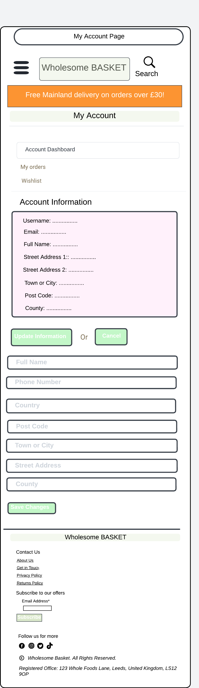

# Wholesome Basket

Wholesome Basket is an e-commerce site developed to provide a simple and secure way to shop for whole foods. Built using Django, the site is designed to be responsive, making it easy to use on any device. It focuses on clean, maintainable code and smooth navigation, aiming to offer a reliable shopping experience for users.

The Wholesome Basket website is targeting health-conscious consumers and individuals interested in purchasing whole, natural, and organic foods. This includes those who are looking for healthy, unprocessed food options, including people following specific dietary lifestyles like vegan, gluten-free, or other dietary restrictions. The site aims to serve a community that values nutritious, sustainable, and ethically sourced food products.

Checkout the live website [here](https://wholesome-basket-e-commerce-72c9883373ee.herokuapp.com/).

---

## Table of Contents

1. ### [User Experience](#user-experience)
2. ### [The Strategy Plane](#the-strategy-plane)
    - [Project Goals](#project-goals)
    - [Target Audience](#target-audience)
    - [First Time User Benefits](#first-time-user-benefits)
    - [Registered User Benefits](#registered-user-benefits)
    - [Admin User Benefits](#admin-user-benefits)
3. [Agile Methodology](#agile-methodology)
    - [User Stories](#user-stories)
4. [Fundamental Structure](#fundamental-structure)
    - [Wireframes](#wireframes)
    - [Entity Relationship Diagram](#entity-relationship-diagram-erd)

## User Experience (UX)

The user experience of Wholesome Basket is designed to be **intuitive** and **user-friendly**.
Users can easily navigate through **well-organized** categories and a **responsive search function**.
The site offers **detailed product information**, ensuring informed decisions, and a **smooth, secure checkout process**.
It's **mobile-friendly**, with features like **wishlists** and **personalized profiles** enhancing the shopping experience.
The **clean design** and **quick access to support** make the site pleasant and reliable to use across all devices.

### Project Goals

The goal of the Wholesome Basket website is to provide a user-friendly platform where customers can easily browse, select, and purchase a variety of whole, natural, and organic food products. The project aims to promote healthier eating habits by offering high-quality, unprocessed foods that cater to various dietary needs and preferences. Additionally, the website seeks to create a seamless online shopping experience that emphasizes accessibility, convenience, and customer satisfaction.

### Target Audience

 - **Health-Conscious Individuals**: People who are focused on maintaining a balanced diet and overall well-being, often seeking out products that support a healthy lifestyle.

- **Organic Food Enthusiasts**: Consumers who prefer organic products, free from synthetic pesticides and fertilizers, and are committed to sustainable and environmentally friendly farming practices.

- **Individuals with Dietary Restrictions**: Those who have specific dietary needs, such as gluten-free, dairy-free, or vegan diets, and seek out products that cater to these requirements.

- **People Looking to Reduce Sugar Intake**: Individuals who are conscious about reducing their sugar consumption and are in search of natural alternatives or low-sugar products.

- **Home Cooks and Food Enthusiasts**: Those who enjoy cooking from scratch and are looking for high-quality, whole ingredients to prepare their meals.

- **Families Focused on Nutrition**: Parents and caregivers who prioritize nutritious meals for their families and are interested in wholesome products that support healthy eating habits.

- **Environmentally Conscious Consumers**: People who are concerned about the environmental impact of their food choices and prefer to purchase products that are sustainably sourced and packaged.

- **Individuals Interested in Specialty Foods**: Consumers looking for specialty or hard-to-find whole food products that may not be available in regular grocery stores.

This diverse audience is united by a common goal of making informed, health-oriented decisions about the food they consume, and they seek a shopping experience that aligns with their values and dietary preferences.

### First Time User Benefits

- **Effortless Navigation**: The website is designed with user-friendly navigation, making it easy for first-time visitors to explore the product catalog. Users can seamlessly browse through categories, access the product list, and quickly find what they’re looking for.
- **Efficient Search Functionality**: A prominent search bar is available, allowing users to swiftly locate specific products they have in mind. This feature enhances the shopping experience by reducing the time spent searching for items.
- **Informative Product Details**: Each product page is rich with essential information. Users can easily access detailed descriptions, including ingredients, nutrition facts, and additional insights that help them make informed purchasing decisions.
- **Simple Registration Process**: New users can quickly create an account with minimal steps, enabling them to start shopping without delays. The registration process is straightforward and designed to encourage engagement.
- **Smooth Payment Experience**: The checkout process is intuitive and efficient, ensuring that users can complete their purchases without any hassle. The payment system is secure and easy to navigate, contributing to a positive overall experience.

### Registered User Benefits

- **Secure and Personalized Login**: Registered users can log in easily to their secure, personalized account, providing a tailored shopping experience.

- **Saved Account Details**: Users can save their personal and payment details to their account, making future shopping sessions more convenient and streamlined.

- **Wishlist and Basket Management**: Registered users can effortlessly add items to their wishlist or directly to their basket, allowing them to save favorite products for later or proceed to purchase.

- **Product Ratings**: Users have the ability to rate products, helping to share their experiences with others and contribute to the community.

- **Persistent Shopping Cart**: Products added to the basket are saved, so users can continue shopping at their own pace without losing their selections.

- **Faster Checkout Process**: With saved details and a personalized account, registered users can enjoy a quicker, more efficient checkout process.

### Admin User Benefits

- **Full Product Management**: Admin users can easily add, edit, and delete products through a user-friendly interface, ensuring the store's inventory is always up-to-date.

- **Category Management**: Admins can efficiently add or remove product categories directly from the admin panel, allowing for flexible organization of products.

- **User Management**: Admin users have the authority to manage the user base, including the ability to remove users when necessary, maintaining the integrity of the community.

## Agile Methodology

This project follows an Agile methodology to ensure flexibility, collaboration, and continuous delivery of features. Here's how the process is managed:
- **User story creation**: User stories are created to define the project goals and user requirements. Each story is a concise description of a feature from the user's perspective, helping to clarify what needs to be built and why.
- **Iterations**: The work is organized into iterations (sprints), with each iteration focusing on completing specific user stories. This approach helps to keep tasks organized and planned, ensuring that progress is made steadily.
- **Progress tracking**: Progress is tracked using GitHub project boards. User stories move from To Do to In Progress, and finally to Done when completed. This helps in keeping track of what's being worked on and what's already completed.
- **Priority labelling**:
    User stories are labeled to manage their priority effectively:
    - **Must Have**: Essential features that will be delivered.
    - **Should Have**: Important features that should be delivered but are not critical.
    - **Could Have**: Nice-to-have features that add value but are not essential.
    - **Won't Have**: Features that will not be included in this project cycle.

This approach helps to maintain focus on delivering the most important features while allowing flexibility for adjustments as the project progresses.

 User Stories Template

 User Stories, Issues

 Project Milestones

 Project Board

- <a href="https://github.com/Monicaular/wholesomebasket" target="_blank">Visit GitHub repository here.</a>

- <a href="https://github.com/users/Monicaular/projects/6" target="_blank">Visit GitHub Project roadmap here.</a>

### User Stories

Iterations

- Iteration 1: Project Setup and Core Foundation
    - Install Django and supporting libraries.
    - Create a new Django project and app.
    - Set up the project to use PostgreSQL.
    - Deploy to Heroku.
    - Viewing products list to choose items/pagination.
    - Identifying website products.

- Iteration 2: User Authentication and Basic E-commerce Features
    - Easy account registration.
    - Easy login and logout.
    - Easy password recovery.
    - Receiving an email confirmation after registering.
    - Selecting quantity for a product.
    - Viewing total purchase amount.
    - Searching products by name or description.
    - Wishlist feature.

- Iteration 3: Product Management and Display
    - Displaying ingredients and allergens for products.
    - Displaying nutrition facts for products.
    - Sorting products by name, price, rating, categories.
    - Sorting products with a specific category.
    - Sorting multiple categories simultaneously.
    - Rating feature.

- Iteration 4: Admin Features and User Experience
    - Adding products for site admin.
    - Editing products for site admin.
    - Deleting products for site admin.
    - Viewing total purchase amount.
    - Receiving an email with order summary.

- Iteration 5: Final Touches and Testing
    - Search and filter functionality refinement.
    - Final testing and bug fixing.
    - Code refactoring and optimization.
    - Comprehensive documentation creation.
    - Final deployment and stress testing.

For detailed look of the project board, check this [link](https://github.com/users/Monicaular/projects/6).

## SEO and Marketing Strategy

- **Meta Data**: Implemented meta tags in the HTML, including both short-tail and long-tail keywords to improve search engine ranking.
- **Image Optimization**: Named all images specifically according to the products they represent to enhance search relevance.
- **Sitemap Generation**: Created a sitemap to ensure thorough indexing by search engines.
- **Robots.txt File**: Added a robots.txt file to guide search engine crawlers effectively.
- **Security Enhancement**: Applied the rel="noopener" attribute to external links for improved security.
- **Page Load Optimization**: Enhanced page load speed through the use of pagination and by compressing images.

## Fundamental Structure

I designed detailed wireframes for both mobile and desktop versions of the project using Lucidchart to ensure a seamless and responsive user experience across all devices.

### Home Page

Home Page Wireframe

#### Mobile

#### Desktop

### Products List Page

Products List Wireframe

#### Mobile

#### Desktop

### Product Details Page

Products Detail Wireframe

#### Mobile

#### Desktop

### Basket Page

Basket Page Wireframe

#### Mobile

#### Desktop

### Checkout Page

Checkout Page Wireframe

#### Mobile

#### Desktop

### Checkout Success Page

Checkout Success Page Wireframe

#### Mobile

#### Desktop

### Add a Product

Add a Product Page Wireframe

#### Mobile

#### Desktop

### Edit a Product Page

Edit a Product Page Wireframe

#### Mobile

#### Desktop

### My Account Page

Account Dashboard Page Wireframe

#### Mobile

#### Desktop

Order History Page Wireframe

#### Mobile

#### Desktop

Wishlist Page Wireframe

#### Mobile

#### Desktop

### Wishlist Page

Wishlist Page Wireframe

#### Mobile

#### Desktop

### Authentication Pages

Sign Out Wireframe

#### Mobile

#### Desktop

Sign In Wireframe

#### Mobile

#### Desktop

Sign Up Wireframe

#### Mobile

#### Desktop

### Entity Relationship Diagram (ERD)

I created an Entity-Relationship Diagram (ERD) to visually represent the database structure and relationships within the project. This ERD was carefully crafted to ensure efficient data management and clear associations between various entities, such as products, users, orders, and ratings. By mapping out the database design in advance, I was able to identify and implement the necessary tables and relationships, ensuring that the application's data flow is both logical and scalable.

## Main Plan

- **Designing a visually appealing homepage** that highlights the website's focus on whole foods, making it clear to users what the site offers right from the start.
- **Implementing a product catalog** that allows users to browse, search, and filter products based on various criteria such as categories, price, and ratings.
- **Setting up secure user accounts** to enable features like adding items to wishlists, saving basket contents, and providing a personalized shopping experience with faster checkouts.
- **Developing a fully responsive website** that delivers a seamless user experience across all devices, with special attention to mobile-friendly navigation and optimized page load speeds.
- **Empowering superusers with the ability** to manage the product catalog, including adding, editing, and deleting products, as well as managing categories and user accounts directly from the admin panel.

## The Strategy Plane

### Features

#### Existing Features

#### Home Page

- **Hero Image with Welcome Text:** The homepage features a striking hero image that immediately captures the user's attention. Overlaid on the image is a warm welcome message that reads, "Welcome to Wholesome Basket. Start your health journey here." This introduction sets the tone for the site, inviting users to explore further. Below the text, a prominent "Shop Now" button is placed, encouraging users to begin shopping with just one click.

- **Shop by Category Section:** Directly below the hero image, the homepage showcases a "Shop by Category" section. This section features key product categories, each represented with visually appealing images. Users can easily click on these images to navigate directly to their desired category, streamlining the shopping experience and helping them find what they need quickly.

#### Footer
The footer maintains a consistent presence across all pages, providing easy access to essential links and features no matter where users navigate on the site. This uniformity ensures that users always have a convenient way to reach contact information, policy details, and social media channels, enhancing overall site usability and cohesion.

- **Contact Us Section**: This section provides essential links and options for user support and information. It includes an "About Us" link that gives users insight into the website's mission, a "Get in Touch" contact form for direct inquiries, a "Privacy Policy" link outlining how user data is handled, and a "Returns Policy" link detailing the process for returns.
- **Subscribe to Our Offers**: Adjacent to the contact section is a subscription area where users can enter their email address to join the mailing list and receive updates on offers and promotions.

- **Social Media Links**: To foster community engagement and provide more ways to stay connected, the footer includes links to the website's social media profiles on Facebook, X (formerly Twitter), Instagram, and TikTok.

### About Us Page

The "About Us" page at Wholesome Basket outlines the brand's commitment to natural, sustainable foods and making healthy eating accessible. It emphasizes quality products, customer care, and eco-friendly practices, inviting users to connect with the team for support and feedback.

### Get in Touch Page

The "Contact Us" page features a simple form where users can provide their email, subject, and message to get in touch with the team. Additionally, there's an option to subscribe to the newsletter by ticking a box.

### Privacy Policy Page

The Privacy Policy page outlines how Wholesome Basket collects, uses, and protects user information. It provides details on data privacy, user rights, and the measures in place to ensure the security of personal data.

### Returns Policy Page

The Returns Policy page details Wholesome Basket's commitment to customer satisfaction with a "No Quibbles 30 Day Quality Guarantee" for UK customers. It explains the process for returning products within 30 days for a full refund, including instructions on how to return items, conditions for returns, and procedures for handling damaged orders.

