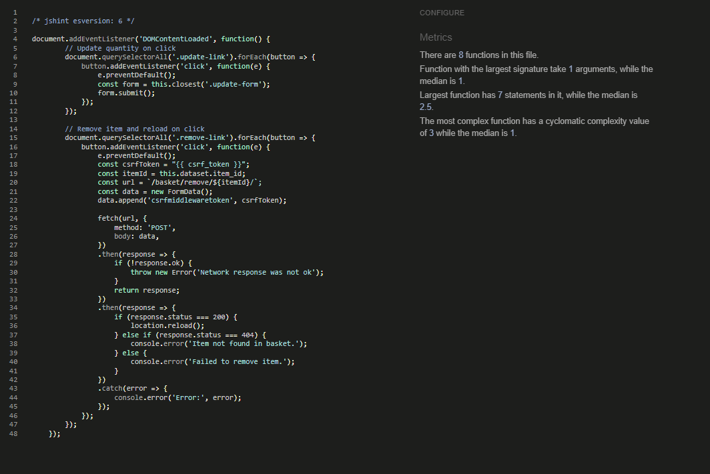
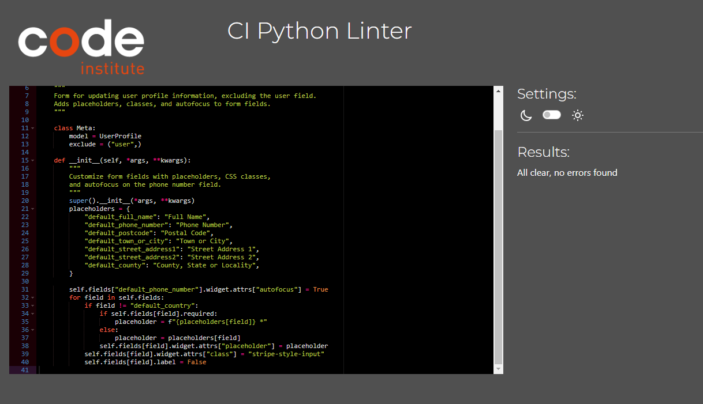
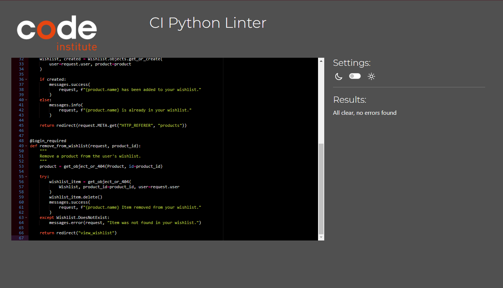
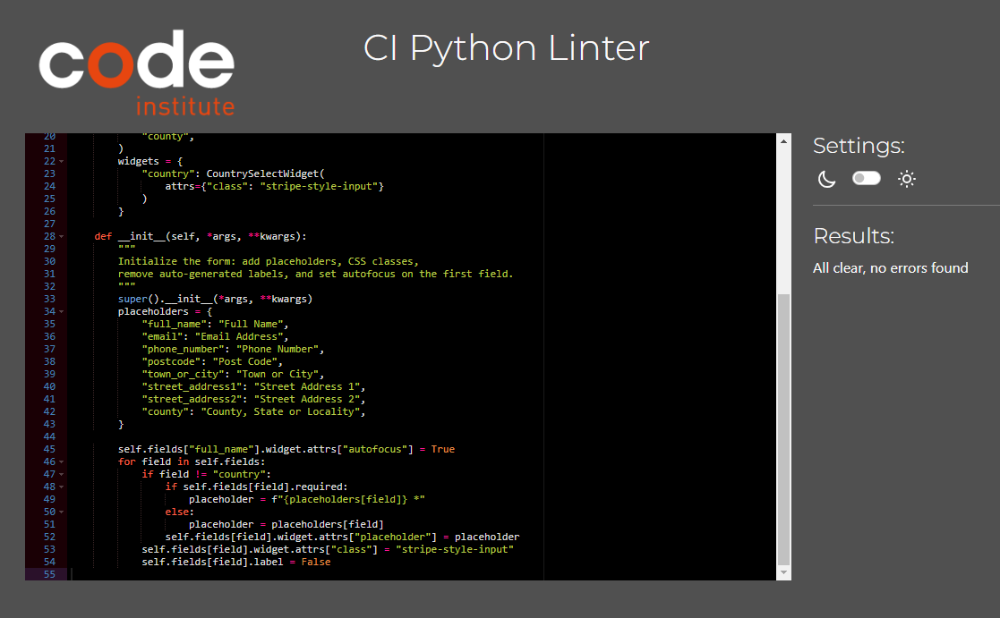
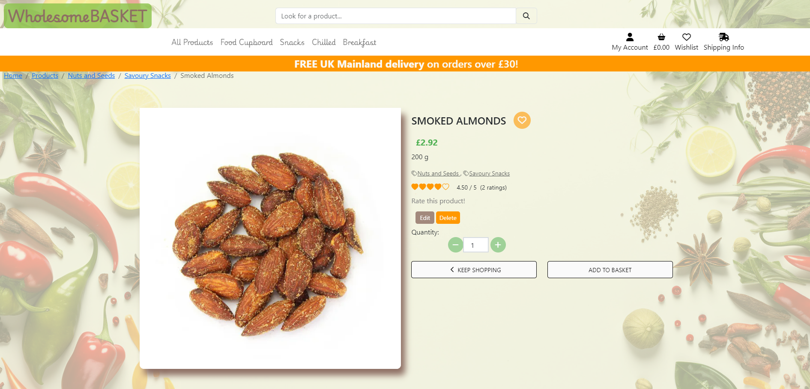
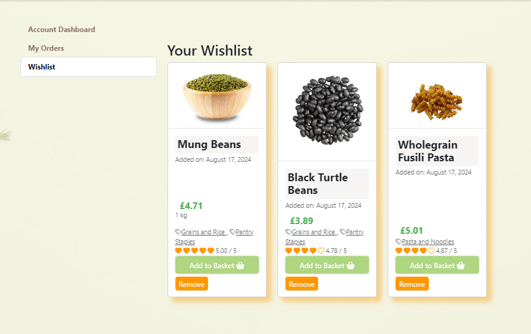

# Testing

Return back to the [README.md](README.md) file.

Throughout the development of this project, I carried out extensive testing to verify that every aspect of the website operates as intended. This section provides comprehensive documentation of all the tests conducted, detailing the procedures, outcomes, and any issues identified and resolved. Each test was designed to rigorously assess the functionality, performance, and user experience of the site, ensuring that it meets the highest standards of quality and reliability.

# Table of Contents

- [Testing](#testing)
  - [Code Validation](#code-validation)
    - [HTML](#html)
    - [CSS Validation](#css-validation)
    - [JavaScript Validation](#javascript-validation)
    - [Python Validation](#python-validation)
  - [Browser Compatibility](#browser-compatibility)
  - [Responsiveness](#responsiveness)
  - [Lighthouse Audit](#lighthouse-audit)
  - [Manual Testing](#manual-testing)
  - [User Story Testing](#user-story-testing)
  - [Testing Summary](#testing-summary)

## Code Validation

I thoroughly tested all of my code using the recommended programming tools for each specific language.

### HTML

I utilized the [W3C HTML Validator](https://validator.w3.org), the recommended tool, to thoroughly validate all of my HTML files.

| Page            | W3C URL                                                                                                                                                   | Screenshot                                 | Notes            |
| --------------- | --------------------------------------------------------------------------------------------------------------------------------------------------------- | ------------------------------------------ | ---------------- |
| Home            | [W3C](https://validator.w3.org/nu/?doc=https%3A%2F%2Fwholesome-basket-e-commerce-72c9883373ee.herokuapp.com%2F)                                                             |   | Pass: No Errors  |
| All Products Page           | [W3C](https://validator.w3.org/nu/?doc=https%3A%2F%2Fwholesome-basket-e-commerce-72c9883373ee.herokuapp.com%2Fproducts%2F)                                                             |   | Pass: No Errors  |
| Product Detail           | [W3C](https://validator.w3.org/nu/?doc=https%3A%2F%2Fwholesome-basket-e-commerce-72c9883373ee.herokuapp.com%2Fproducts%2F)                                                             |   | Pass: No Errors  |
| About US           | [W3C](https://validator.w3.org/nu/?doc=https%3A%2F%2Fwholesome-basket-e-commerce-72c9883373ee.herokuapp.com%2Fabout%2F)                                                             |   | Pass: No Errors  |
| Privacy Policy          | [W3C](https://validator.w3.org/nu/?doc=https%3A%2F%2Fwholesome-basket-e-commerce-72c9883373ee.herokuapp.com%2Fprivacy-policy%2F)                                                             |   | Pass: No Errors  |
| Delivery Info           | [W3C](https://validator.w3.org/nu/?doc=https%3A%2F%2Fwholesome-basket-e-commerce-72c9883373ee.herokuapp.com%2Fdelivery-terms%2F)                                                             |   | Pass: No Errors  |
| Returns Policy           | [W3C](https://validator.w3.org/nu/?doc=https%3A%2F%2Fwholesome-basket-e-commerce-72c9883373ee.herokuapp.com%2Fquality_guarantee%2F)                                                             |   | Pass: No Errors  |
| Account Info          | [W3C](https://validator.w3.org/nu/?doc=https%3A%2F%2Fwholesome-basket-e-commerce-72c9883373ee.herokuapp.com%2Fprofile%2F)                                                             |   | Pass: No Errors  |
| Log Out          | [W3C](https://validator.w3.org/nu/?doc=https%3A%2F%2Fwholesome-basket-e-commerce-72c9883373ee.herokuapp.com%2Faccounts%2Flogout%2F)                                                             |   | Pass: No Errors  |
| Log In          | [W3C](https://validator.w3.org/nu/?doc=https%3A%2F%2Fwholesome-basket-e-commerce-72c9883373ee.herokuapp.com%2Faccounts%2Flogin%2F)                                                             |   | Pass: No Errors  |
| Register         | [W3C](https://validator.w3.org/nu/?doc=https%3A%2F%2Fwholesome-basket-e-commerce-72c9883373ee.herokuapp.com%2Faccounts%2Flogin%2F)                                                             |   | Pass: No Errors  |
| Add Product        | [W3C](https://validator.w3.org/nu/?doc=https%3A%2F%2Fwholesome-basket-e-commerce-72c9883373ee.herokuapp.com%2Faccounts%2Flogin%2F)                                                             |   | Pass: No Errors  |
| Edit Product        | [W3C](https://validator.w3.org/nu/?doc=https%3A%2F%2Fwholesome-basket-e-commerce-72c9883373ee.herokuapp.com%2Fproducts%2Fedit%2F86%2F)                                                             |   | Pass: No Errors  |
| Basket        | [W3C](https://validator.w3.org/nu/?doc=https%3A%2F%2Fwholesome-basket-e-commerce-72c9883373ee.herokuapp.com%2Fbasket%2F)                                                             |   | Pass: No Errors  |
| Checkout        | [W3C](https://validator.w3.org/nu/?doc=https%3A%2F%2Fwholesome-basket-e-commerce-72c9883373ee.herokuapp.com%2Fcheckout%2F)                                                             |   | Pass: No Errors  |
|Checkout Success        | [W3C](https://validator.w3.org/nu/?doc=https%3A%2F%2Fwholesome-basket-e-commerce-72c9883373ee.herokuapp.com%2Fbasket%2F)                                                             |   | Pass: No Errors  |
|Wishlist        | [W3C](https://validator.w3.org/nu/?doc=https%3A%2F%2Fwholesome-basket-e-commerce-72c9883373ee.herokuapp.com%2Fwishlist%2F)                                                             |   | Pass: No Errors  |

### CSS Validation

I have validated all of my CSS files using the [W3C CSS Validator](https://jigsaw.w3.org/css-validator).

| File           | Screenshot                                                    | Notes            |
|----------------|---------------------------------------------------------------|------------------|
| `base.css`     |           | Pass: No Errors  |
| `checkout.css` |       | Pass: No Errors  |
| `profile.css`  |       | Pass: No Errors  |

### JavaScript Validation

I have validated all of my JS files using the [JSHint Validator](https://jshint.com).

| File                                | Screenshot                                          | Notes                                               |
|-------------------------------------|----------------------------------------------------|-----------------------------------------------------|
| `basket.html` (postloadjs)            |          | Pass: No Errors                                     |
| `stripe_elements.js`                  |          | Pass: No Errors                                     |
| `delete_modal.js`     |          | Pass: No Errors                                     |
| `preview-product-image.js`    |          | Pass: No Errors                                     |
| `rating.js`       |          | Pass: No Errors                                     |
| `adjust-quantity-script.html`             |          | Pass: No Errors                                     |
| `products-categories-display-script.html`        |          | Pass: No Errors |
| `add_product.html` (postloadjs)                |           | Pass: No Errors                           |
| `edit_product.html` (postloadjs)                |           | Pass: No Errors                           |
| `toasts.js`               |           | Unused variables: 	showSuccessToast, showWarningToast, showInfoToast, showErrorToast |
| `base.html` (postloadjs)                |           | Pass: No Errors                           |

### Python Validation

I have used [Black](https://black.readthedocs.io/en/stable/) to format all my Python code according to standard practices, setting the maximum line length to 79 characters. However, it's important to note that Black may still keep some lines up to 88 characters long. This is because Black prioritizes readability and consistent formatting, even if it means slightly exceeding the specified line length in certain cases. I also randomly tested several Python files using [PEP8 CI](https://pep8ci.herokuapp.com/) to ensure the formatting was applied correctly.

| File                         | Screenshot                                              | Notes           |
|------------------------------|---------------------------------------------------------|-----------------|
| Basket contexts.py              |               | Pass: No Errors |
| Basket urls.py                  |               | Pass: No Errors |
| Basket views.py                 |               | Pass: No Errors |
| Profiles models.py                 |               | Pass: No Errors |
| Profiles forms.py                |               | Pass: No Errors |
| Products models.py            |               | 72: E501 line too long (83 > 79 characters) |
| Products admin.py            |               | Pass: No Errors |
| Products views.py           |               | 140: E501 line too long (86 > 79 characters), 224: E501 line too long, (86 > 79 characters), 317: E501 line too long (86 > 79 characters) |
| Wishlist urls.py          |               | Pass: No Errors |
| Wishlist views.py             |               | Pass: No Errors |
| Checkout forms.py            |               | Pass: No Errors |
| Checkout models.py            |               | Pass: No Errors |
| Checkout webhook_handler.py  |               | 115: E501 line too long (107 > 79 characters), 152: E501 line too long (81 > 79 characters), 166: E501 line too long (93 > 79 characters), 177: E501 line too long (119 > 79 characters) |

## Browser Compatibility

I have tested my deployed project across multiple browsers to ensure compatibility.

| Browser | Screenshot | Notes |
| --- | --- | --- |
| Chrome |  | Functions as expected |
| Firefox |  | Functions as expected |
| Edge |  | Functions as expected |

## Responsiveness

I have tested my deployed project on various devices to ensure it is fully responsive.

| Device | Screenshot | Notes |
| --- | --- | --- |
| Mobile (Responsively App) |    | Functions as expected |
| Tablet (Responsively App) |    | Functions as expected |
| Laptop (Responsively App)|   | Functions as expected |
| Desktop (DevTools)|   | Functions as expected |

## Lighthouse Audit

I used the Lighthouse Audit tool to assess my deployed project for any significant issues.

| Page | Size | Screenshot | Notes |
| --- | --- | --- | --- |
| Home | Desktop |  | **Score: 71** - Moderate performance; improvements recommended. |
| Home | Mobile |  | **Score: 59** - Moderate performance; mobile optimizations needed. |
| Products | Desktop |  | **Score: 63** - Moderate performance; optimizations possible. |
| Products | Mobile |  | **Score: 61** - Moderate performance; mobile optimizations needed. |
| Product detail | Desktop |  | **Score: 82** - Near optimal performance; minor improvements possible. |
| Product detail | Mobile |  | **Score: 63** - Moderate performance; mobile optimizations needed. |
| Wishlist | Desktop |  | **Score: 63** - Moderate performance; optimizations possible. |
| Wishlist | Mobile |  | **Score: 58** - Moderate performance; mobile optimizations needed. |
| Add Product | Desktop |  | **Score: 78** - Moderate to good performance; minor optimizations recommended. |
| Add Product | Mobile |  | **Score: 62** - Moderate performance; mobile optimizations needed. |
| Edit Product | Desktop |  | **Score: 75** - Moderate performance; optimizations recommended. |
| Edit Product | Mobile |  | **Score: 61** - Moderate performance; mobile optimizations needed. |
| Profile | Desktop |  | **Score: 55** - Moderate performance; significant improvements needed. |
| Profile | Mobile |  | **Score: 55** - Moderate performance; significant improvements needed. |
| Basket | Desktop |  | **Score: 80** - Good performance; minor optimizations possible. |
| Basket | Mobile |  | **Score: 59** - Moderate performance; mobile optimizations needed. |
| Delivery Terms | Desktop |  | **Score: 83** - Near optimal performance; minor improvements possible. |
| Delivery Terms | Mobile |  | **Score: 64** - Moderate performance; mobile optimizations needed. |
| Privacy Policy | Desktop |  | **Score: 85** - Near optimal performance; minor improvements possible. |
| Privacy Policy | Mobile |  | **Score: 64** - Moderate performance; mobile optimizations needed. |
| Log Out | Desktop |  | **Score: 78** - Moderate to good performance; minor optimizations recommended. |
| Log Out | Mobile |  | **Score: 67** - Moderate performance; some improvements needed. |
| Sign Up | Desktop |  | **Score: 79** - Moderate to good performance; minor optimizations recommended. |
| Sign Up | Mobile |  | **Score: 68** - Moderate performance; some improvements needed. |
| Log In | Desktop |  | **Score: 85** - Near optimal performance; minor improvements possible. |
| Log In | Mobile |  | **Score: 68** - Moderate performance; some improvements needed. |
| Checkout | Desktop |  | **Score: 64** - Moderate performance; optimizations recommended. |
| Checkout | Mobile |  | **Score: 57** - Moderate performance; mobile optimizations needed. |
| Checkout Success | Desktop |  | **Score: 71** - Moderate performance; improvements recommended. |
| Checkout Success | Mobile |  | **Score: 63** - Moderate performance; mobile optimizations needed. |

## Manual testing

| Page | User Action | Expected Result | Pass/Fail | Comments |
| --- | --- | --- | --- | --- |
| **Homepage** | | | | |
| | Click on Shop Now button | Takes the user to the All Products page | Pass | n/a |
| | Click on the Logo | Refreshes the page | Pass | n/a |
| | Click on one category | Takes the user to that category | Pass | That certain category sidebar is ticked on the products page |
| **Search Bar** | | | | |
| | Insert a word and press Enter/press search icon | Displays the results for user | Pass | In the case that the products contain that word or part of the word |
| | No word inserted | User gets an error | Pass | The error shows: enter a search criteria |
| | Insert word that is not in any product | User gets zero results | Pass | User gets the message "0 products found" |
| **Footer** | | | | |
| | Click on the About Us link | User is taken to About Us page | Pass | n/a |
| | Click on the Get in Touch link | User is taken to a contact form | Pass | n/a |
| | Click on the Privacy Policy link | User is taken to the Privacy Policy page | Pass | n/a |
| | Click on the Returns Policy link | User is taken to the Returns Policy page | Pass | n/a |
| | Insert email and click on Subscribe button | User is taken to the success subscription page | Pass | User is seeing the success message for subscription |
| | Click on any of the social media icons | User is taken to that social media profile | Pass | n/a |
| **Products** | | | | |
| | Click on any of the categories on the side | Page displays products from that category | Pass | n/a |
| | Untick the category they are on | The page displays all the products | Pass | n/a |
| | Click on a product image | User is taken to that product detail page | Pass | n/a |
| | Click on the Add to Basket button | One unit of that product is added to the basket | Pass | User gets a notification that the product has been added to the basket |
| | Admin user clicks on the Edit button | Admin user is taken to Edit form page | Pass | n/a |
| | Admin user clicks on the Delete button | User gets a pop-up modal | Pass | User can delete the product or cancel |
| | User clicks on the Heart button | Product is added to the wishlist | Pass | User gets a success message |
| | User clicks on the Heart button on the same product | User gets a message that the product is already in the wishlist | Pass | n/a |
| **Product Detail** | | | | |
| | Click on Rate This Product link | A box with fillable hearts opens | Pass | n/a |
| | Fill the hearts and click on Submit | User gets a success message | Pass | User cannot rate the same product twice |
| | Insert numbers in the quantity input and click on Add to Basket | The number of products selected are added to the basket | Pass | User gets a notification |
| | Use the plus/minus to adjust quantity for the product and click on Add to Basket | The number of the item selected is added to the basket | Pass | n/a |
| | Click on the Heart button | Product is added to the wishlist | Pass | User gets a success message |
| | Admin user clicks on the Edit button | Admin user is taken to Edit form page | Pass | n/a |
| | Admin user clicks on the Delete button | User gets a pop-up modal | Pass | User can delete the product or cancel |
| | Click on the Description tab | Product description is displayed | Pass | n/a |
| | Click on the Ingredients tab | Product ingredients are displayed | Pass | n/a |
| | Click on the Nutrition Facts tab | Product nutrition facts are displayed | Pass | n/a |
| | Click on the Interesting Facts tab | Product interesting facts are displayed | Pass | n/a |
| | Click on the View button on the related product | User is taken to that product detail page | Pass | n/a |
| | Click on the Keep Shopping button | User is taken back to the Products page | Pass | n/a |
| **Product Management** | | | | |
| | Admin user clicks on the Edit button on product | Admin user is taken to Edit Product page | Pass | n/a |
| | Admin user clicks on the Delete button on product | User gets a pop-up modal | Pass | User can delete the product or cancel |
| | User clicks on the Delete button on modal | Product is deleted | Pass | User is taken to the products page and receives a success notification |
| | User clicks on the Heart button on product | Product is added to the wishlist | Pass | User gets a success message |
| **Basket** | | | | |
| | User adds a product to the basket and clicks on the Checkout button | User is taken to the Basket page | Pass | User gets a success message |
| | User clicks on the product name in the basket | User is taken to that product detail page | Pass | n/a |
| | User changes the quantity and clicks on Update | The quantity of the product and the order summary is updated | Pass | User is shown a success message |
| | User clicks on the Bin icon | Product gets deleted from the basket and the order summary updates accordingly | Pass | User is shown a success message |
| | User clicks on the Keep Shopping button | User is taken back to the Products page | Pass | n/a |
| | User clicks on the Secure Checkout button | User is taken to the Checkout page | Pass | n/a |
| **Checkout** | | | | |
| | User clicks on the product name in the basket | User is taken to that product detail page | Pass | n/a |
| | User fills in all the required fields and clicks Complete Order | User is taken to the Checkout Success page | Pass | User is shown their order summary again and receives a confirmation email |
| | User clicks on the Adjust Basket button | User is taken back to the Basket page | Pass | User can modify the products in the basket |
| **Checkout Success** | | | | |
| | User clicks on Continue Shopping button | User is taken to the Products page | Pass | n/a |
| **Sign In** | | | | |
| | User inserts credentials and clicks Sign In | User is taken to the homepage or to the page they were on before signing in | Pass | n/a |
| **Sign Out** | | | | |
| | User clicks on Sign Out button | User is taken to the homepage | Pass | n/a |
| **Sign Up** | | | | |
| | User fills their credentials and clicks Sign Up button | User is shown a message to verify their email | Pass | n/a |
| | User clicks on the link sent to their email | User is taken to the Confirm button | Pass | n/a |
| | User clicks on the Confirm button | User is taken to the Sign In page | Pass | User needs to insert their credentials |
| **Account** | | | | |
| | User clicks on the My Account tab under Account | User is taken to their account details | Pass | User is displayed the account info tab |
| | User clicks on the Update Information button in Account Dashboard | User is displayed a form | Pass | User can cancel the update |
| | User fills the form and clicks Save Changes | Information box is updated | Pass | n/a |
| | User clicks on the Order Number link in My Orders tab | User is taken to that order summary | Pass | User can go back to their profile |
| | User clicks on the Add to Basket button in My Wishlist tab | Product is added to the basket | Pass | User gets a success or info message |
| | User clicks on the Remove button in My Wishlist tab | Product is removed from the wishlist | Pass | User is shown a success message |

## User Story Testing

Below are the user stories I've included, along with corresponding screenshots for your review:

| User Story | Screenshot |
| --- | --- |
| As a shopper I can identify what the website is selling so that I can understand the types of products available and decide if they meet my needs. |  |
| As a shopper, I can see a list of products, so that I can easily choose the ones that I need. |   |
| As a shopper I can view my total purchase amount at any time, so that I can manage my spending and avoid exceeding my budget. |  |
|As a site user I can easily register for an account, so that I can save my preferences, track orders, and receive personalized recommendations. |   |
| As a site user, I can easily log in and log out of my account, so that I can access personalized features and ensure my account security. |    |
| As a site user I can have a personalized user profile, so that I can manage my preferences, view order history, and receive personalized recommendations. |    |
|As a site user I can have a wishlist where I can save products for future reference or purchase, so that I can easily track items I am interested in. |  |
| As a site user, I can sort the list of available products by price, alphabetically, and popularity, so that I can find products more easily based on my preferences. |  |
| As a site user, I can sort products within a specific category by various criteria, so that I can easily find the most relevant products in that category. |  |
|As a site user, I can sort products across multiple categories simultaneously by various criteria, so that I can compare and find the most relevant products efficiently. |  |
| As a site user, I can search for products by entering keywords related to their name or description, so that I can quickly find specific products that match my interests or needs. |  |
| As a site user, I can easily select the quantity of a product when purchasing it, so that I can ensure I am ordering the correct amount of the item. |    |
| As a site user, I can easily select the quantity of a product when purchasing it, so that I can ensure I am ordering the correct amount of the item. |  |
| As a shopper, I can view the ingredients and allergens for products so that I can make informed decisions about their suitability for my dietary needs and preferences. |  |
| As a site admin I can add new products directly from the website so that I can efficiently manage the product catalog without accessing the admin panel. |  |
|As a site admin I can edit products directly from the website so that I can efficiently update product details without accessing the admin panel. |  |
|As a site admin I can delete products directly from the website so that I can efficiently remove products from the catalog without accessing the admin panel. |   |
|As a new user, I can receive an email confirmation after registering so that I can verify my email address and activate my account. |  |
|As a shopper, I can receive an email with the order summary after making a purchase so that I can review the details of my order and have a record for future reference. |  |
|As a shopper I can rate products that I have purchased or viewed so that I can share my opinion on the product's quality and help others make informed decisions. |   |

Below are the user stories that I plan to implement in the future:

| User Story | Screenshot |
| --- | --- |
| As a shopper, I can see if a product is out of stock on the product listing page so that informed purchasing decisions and avoid clicking on unavailable items. | N/A |
| As a site user I can easily select the size and quantity of a product with different prices for each size so that I can ensure I am ordering the correct amount and dimensions of the item at the appropriate price. | N/A |
| As a shopper I can easily identify offers and discounts, so that I can save money on my purchases. | N/A |

## Testing Summary

Comprehensive testing was conducted across various aspects of the site to ensure a seamless user experience, robust functionality, and adherence to best practices. The testing included:

1. **Responsiveness Testing**: The site was tested for responsiveness across different devices, including mobile, tablet, and desktop. The tests confirmed that the site adapts well to different screen sizes, ensuring a consistent user experience across all devices.

2. **HTML Validation**: The site's HTML code was validated using the W3C HTML Validator. The validation ensured that the markup adheres to web standards, contributing to better accessibility and SEO performance.

3. **CSS Validation**: CSS code was validated using the W3C CSS Validator. The validation process confirmed that the stylesheets are free of errors and follow best practices, leading to consistent presentation across browsers.

4. **JavaScript Code Review**: The JavaScript code was reviewed for functionality and efficiency. The review focused on ensuring that scripts are optimized for performance, properly handle errors, and do not negatively impact the user experience.

5. **Python Code Review**: The Python backend code was thoroughly reviewed for efficiency, security, and adherence to best practices. This review included checking for proper use of data structures, error handling, and security measures like input validation and protection against common vulnerabilities.

6. **Performance Testing**: Performance scores were evaluated for various pages on both desktop and mobile platforms. The results highlight areas where optimizations could improve user experience.

7. **Manual Testing**: All key user actions were validated across different pages, including navigation, product interactions, basket operations, and checkout processes. Each interaction was verified to meet expected outcomes, ensuring the site functions as intended.

8. **Admin Functionality Testing**: Administrative features were tested, including product management tasks such as creating, updating, and deleting products. This ensured that site administrators can effectively manage content.

9. **User Story Testing**: Specific user stories were tested to confirm that the site meets user needs, such as viewing and filtering products, managing accounts, adding items to the basket, and completing purchases. The responsiveness of the site was also tested across mobile, tablet, and desktop platforms.

Overall, the site was tested thoroughly to ensure both end-users and administrators can interact with the platform effectively and efficiently. The results indicate that the site is performing well with minor areas for improvement identified, ensuring a high-quality, responsive, and reliable user experience.

